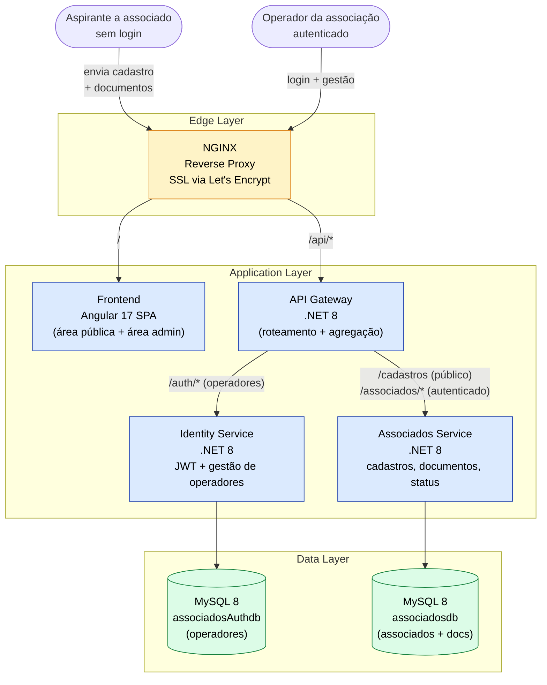
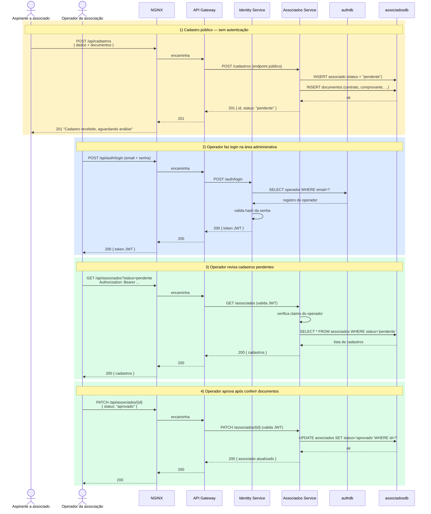

# DocBrasil — Plataforma de Gestão para Associação Jurídica

> Plataforma web full-stack em arquitetura de microsserviços (.NET 8 + Angular 17) para gestão de associados e documentos de uma associação jurídica. Construída do zero como freelance, do design da arquitetura ao deploy em produção.


> **Status do projeto:** descontinuado. A plataforma chegou a operar em produção (`appdocdobrasil.com.br`) por aproximadamente 2 meses antes de ser encerrada por decisão comercial do cliente. O código permanece aqui como referência técnica.

---

## Sumário

- [Visão geral](#visão-geral)
- [Arquitetura](#arquitetura)
- [Fluxo do ciclo de cadastro](#fluxo-do-ciclo-de-cadastro)
- [Stack técnica](#stack-técnica)
- [Estrutura do projeto](#estrutura-do-projeto)
- [Como rodar localmente](#como-rodar-localmente)
- [CI/CD e deploy](#cicd-e-deploy)
- [Decisões de arquitetura](#decisões-de-arquitetura)
- [Aprendizados](#aprendizados)
- [Autor](#autor)

---

## Visão geral

O DocBrasil automatizou o ciclo de **entrada de novos associados** em uma associação jurídica, com dois perfis de uso bem distintos:

**Público (sem login)** — o aspirante a associado preenche um formulário público no site e envia seus documentos: contrato assinado, comprovante de residência e demais anexos exigidos pela associação. O cadastro é criado no sistema com status `pendente`.

**Operadores da associação (com login)** — os funcionários autenticados recebem os cadastros pendentes, conferem se os documentos estão completos e corretos (contrato assinado, comprovante de residência válido, etc.) e aprovam ou rejeitam a entrada. Operadores também acompanham o status dos associados aprovados ao longo do tempo.

Em resumo: **associado não faz login** — ele só envia o cadastro. O sistema autenticado é a área administrativa da associação, usada por quem gerencia esses cadastros.

A escolha por microsserviços separados para domínio e autenticação foi deliberada: permite escalar o serviço de identidade de forma independente, isolar incidentes e seguir o princípio de menor privilégio para os bancos.

---

## Arquitetura



**Pontos-chave da arquitetura:**

- **NGINX** termina o SSL (certificados renovados automaticamente via Certbot) e roteia o tráfego entre o frontend e a API gateway.
- **API Gateway** é a entrada única para a API. Distingue endpoints **públicos** (envio de cadastros por aspirantes) e **autenticados** (gestão por operadores). Centraliza CORS, rate limiting e logs.
- **Identity Service** gerencia exclusivamente **operadores** da associação — aspirantes a associados não têm conta e nunca chegam a este serviço.
- **Associados Service** expõe endpoints públicos para receber cadastros e endpoints protegidos por JWT para a área administrativa.
- **Comunicação inter-serviço** acontece via HTTP REST; tokens JWT são validados em cada serviço autenticado.

---

## Fluxo do ciclo de cadastro

Fluxo completo desde a inscrição pública até a aprovação pelo operador.



**Resumo das responsabilidades por etapa:**

| Etapa | Quem | Autenticado? | O que faz |
|-------|------|--------------|-----------|
| 1 | Aspirante | ❌ Não | Envia formulário público com dados pessoais e anexos |
| 2 | Operador | ✅ Sim (JWT) | Faz login na área administrativa |
| 3 | Operador | ✅ Sim (JWT) | Lista cadastros pendentes, abre documentos para conferir |
| 4 | Operador | ✅ Sim (JWT) | Aprova ou rejeita conforme análise dos documentos |

---

## Stack técnica

**Backend (C# / .NET 8)**
- ASP.NET Core Web API
- Entity Framework Core (Pomelo MySQL provider)
- Autenticação JWT (Bearer tokens)
- Arquitetura Clean / DDD: camadas `Application`, `Domain`, `Infra.Data`, `Infra.IoC`, `Infra.CrossCutting`

**Frontend**
- Angular 17 (standalone components)
- Angular Material 17 + Angular CDK
- RxJS, Angular Forms reativos
- `jwt-decode` para parsear tokens
- `ngx-image-cropper` para upload de fotos
- `ngx-mask` para máscaras de input

**Dados**
- MySQL 8 (dois bancos isolados: domínio + autenticação)

**Infra & DevOps**
- Docker Compose (8 containers orquestrados)
- NGINX como reverse proxy + terminação SSL
- Let's Encrypt + Certbot para renovação automática de certificados
- Azure DevOps Pipelines (CI/CD)
- Azure Key Vault (gestão de secrets)
- Deploy em VM Azure com agente self-hosted

---

## Estrutura do projeto

```
project-root/
├── backend/
│   ├── DocAssociados/                         # serviço de domínio (associados, documentos)
│   │   ├── DocAssociados.WebApi/              # entry-point HTTP
│   │   ├── DocAssociados.Application/         # casos de uso, DTOs, validators
│   │   ├── DocAssociados.Domain/              # entidades, regras de negócio
│   │   ├── DocAssociados.Infra.Data/          # EF Core, repositories
│   │   ├── DocAssociados.Infra.IoC/           # injeção de dependência
│   │   └── DocAssociados.Infra.CrossCutting/  # logging, helpers compartilhados
│   ├── DocAssociados.ApiGateway/              # gateway HTTP
│   └── DocAssociados.Identity/                # serviço de autenticação / usuários
│       ├── DocAssociados.Identity.WebApi/
│       ├── DocAssociados.Identity.Application/
│       ├── DocAssociados.Identity.Domain/
│       ├── DocAssociados.Identity.Infra.Data/
│       └── DocAssociados.Identity.CrossCutting/
├── frontend/
│   └── doc-brasil/                            # Angular 17 SPA
├── nginx/
│   ├── conf.d/                                # virtual hosts
│   └── ssl/                                   # certificados (gerados em runtime)
├── .github/workflows/                         # GitHub Actions (auxiliar)
├── azure-pipelines.yml                        # pipeline principal
├── docker-compose.yml                         # base
├── docker-compose-dev.yml                     # ambiente local
├── docker-compose-prod.yml                    # ambiente produção
└── docker-compose-cerbot.yml                  # job de renovação SSL
```

---

## Como rodar localmente

### Pré-requisitos

- Docker Desktop 24+
- Docker Compose v2
- Git

### Passos

```bash
# 1) Clone o repositório
git clone https://github.com/riverson98/associados-project-root.git
cd associados-project-root

# 2) Copie o template de variáveis e preencha
cp .env.example .env

# 3) Suba o stack de desenvolvimento
docker compose -f docker-compose.yml -f docker-compose-dev.yml up -d

# 4) Acompanhe os logs
docker compose logs -f
```

Acesse:
- **Frontend:** `http://localhost:4200` (ou `8080` conforme `docker-compose-dev.yml`)
- **API Gateway:** `http://localhost:8090`
- **MySQL domínio:** `localhost:3311`
- **MySQL auth:** `localhost:3312`

### Parar tudo

```bash
docker compose down
```

---

## CI/CD e deploy

O pipeline em `azure-pipelines.yml` faz:

1. **Checkout do código** no agente self-hosted (VM Azure).
2. **Fetch dos secrets** do Azure Key Vault (credenciais de banco, chaves, certificados SSL).
3. **Materialização dos certificados** para a pasta `nginx/ssl/`.
4. **Build das imagens Docker** usando `docker-compose-prod.yml`.
5. **Stop + restart** do stack em produção sem downtime perceptível para imagens já cacheadas.
6. **Renovação automática** de certificados via job dedicado (`certbot-renew`).

---

## Decisões de arquitetura

**Por que microsserviços em vez de monólito?**
A separação entre autenticação e domínio foi pensada para permitir que o serviço de autenticação fosse reutilizado em projetos futuros do mesmo cliente. Cada serviço tem seu próprio banco isolado — útil aqui porque o banco de **operadores** (poucos registros, pouca rotatividade) tem perfil de uso completamente diferente do banco de **associados e documentos** (volume e crescimento bem maiores).

**Por que NGINX como reverse proxy?**
Centraliza terminação SSL, simplifica a renovação de certificados via Certbot e isola frontend e backend em redes Docker internas, expondo apenas as portas 80/443.

**Por que Azure Key Vault?**
Eliminou a necessidade de manter secrets em arquivos `.env` no servidor. O pipeline busca os valores no build e injeta como variáveis de ambiente nos containers.

**Por que Clean Architecture / DDD?**
A camada de domínio fica independente de frameworks (EF Core, ASP.NET), o que facilita testes unitários e troca futura de infraestrutura sem reescrever regras de negócio.

---

## Aprendizados

Como projeto encerrado, ele rendeu algumas lições que carrego para projetos novos:

- **Mais de uma forma de orquestrar microsserviços** — comecei com chamadas HTTP síncronas via gateway; se fosse refazer, avaliaria mensageria (RabbitMQ / Service Bus) para operações que não precisam de resposta imediata.
- **Secrets nunca em `.env` versionado** — independente da visibilidade do repo. Key Vault desde o dia um.
- **CI/CD mais cedo** — pipeline foi configurado tardiamente; nas próximas iterações começo pelo deploy, não termino por ele.

---

## Autor

**Riverson Costa** — Desenvolvedor Fullstack

- 🌐 [riversoncosta.com](https://riversoncosta.com)
- 💼 [LinkedIn](https://linkedin.com/in/riverson-dev)
- 🐙 [GitHub](https://github.com/riverson98)
- ✉️ riversonvicente@gmail.com

---

## Licença

[MIT](LICENSE)
